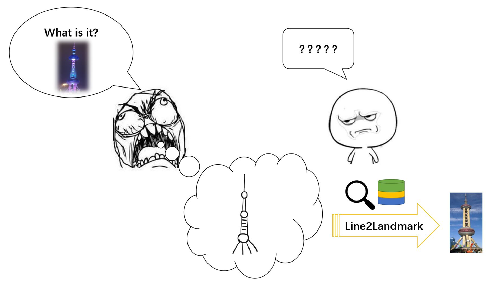
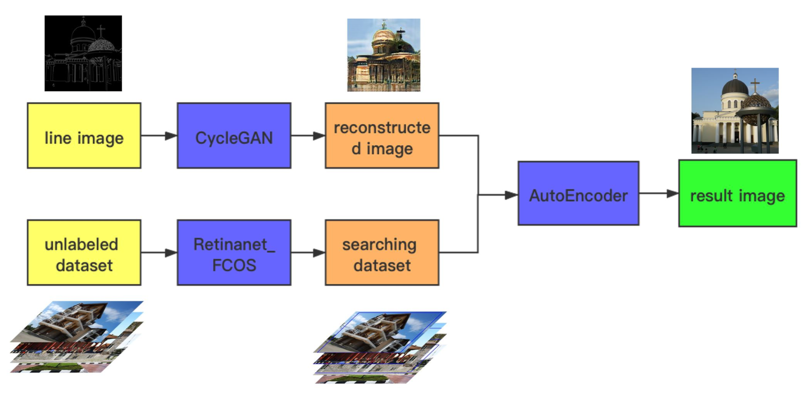
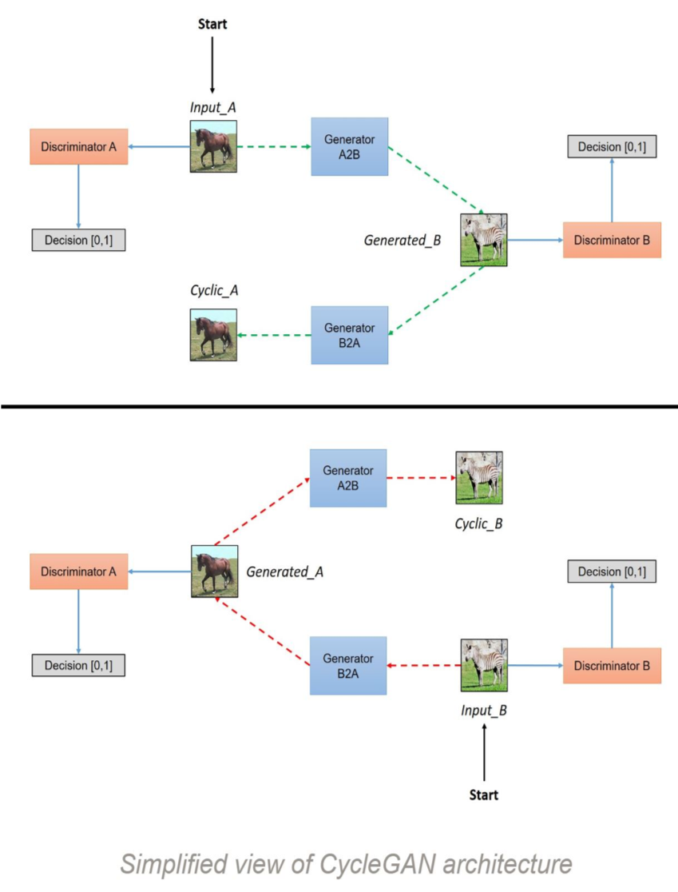
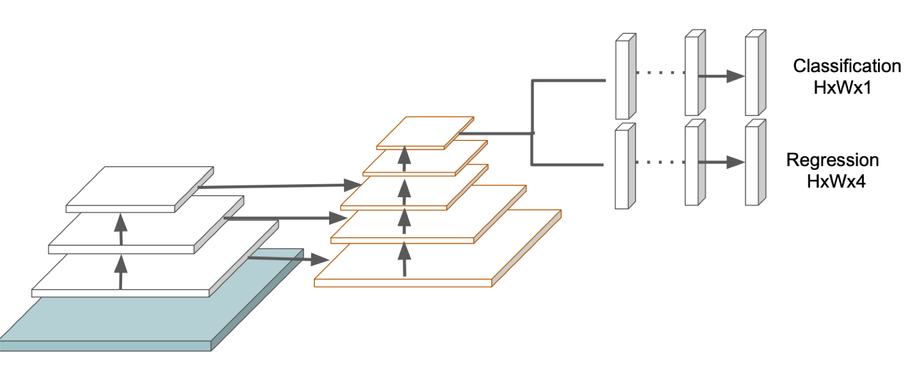
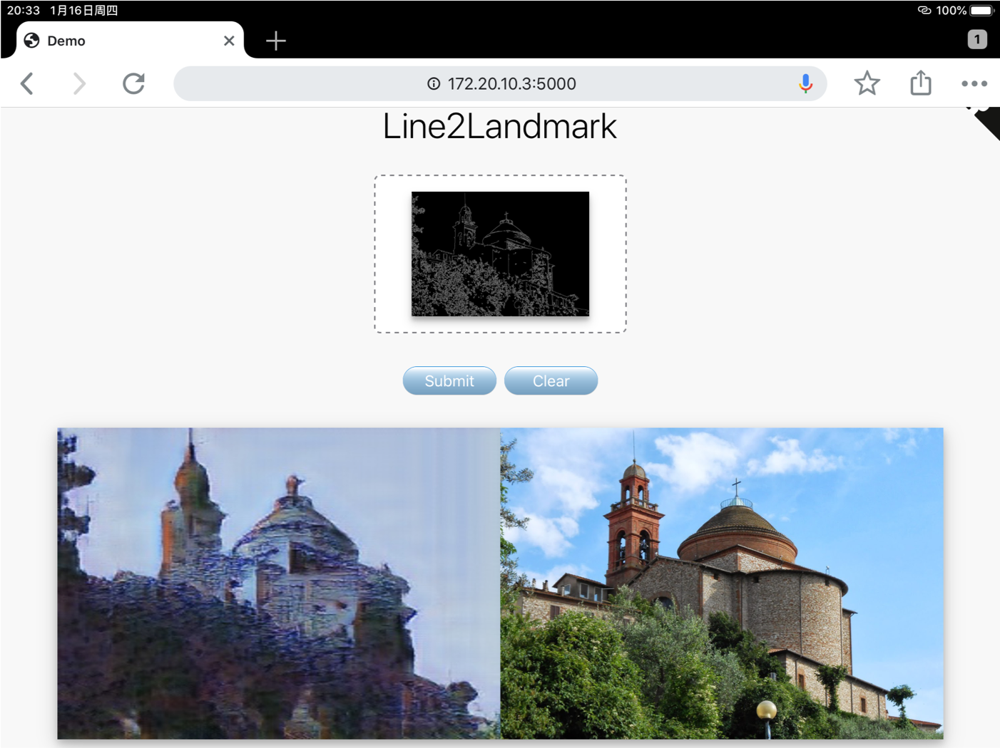

# Line2Landmark
Landmark Searching Based on Hand-Painted Building Lines  
Google ML Winter Camp 2020  Project 

## Background


## Tech
We use three models to realize the process of image reconstruction, object detection and image similarity comparison.



### Image Reconstruction
Model: `CycleGAN`



### Detection
Model: `Retinanet` + `FCOS`



### Image Retrieval
Model: reconstruct imgs + original imgs -> `autoencoder`


## Demo
``` python
# place models
cd webapp
python app.py # demo will run on http://127.0.0.1:5000/
```
